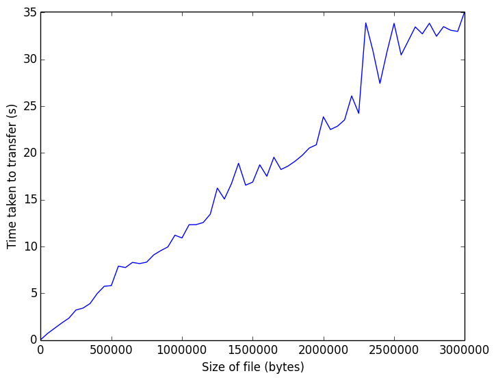
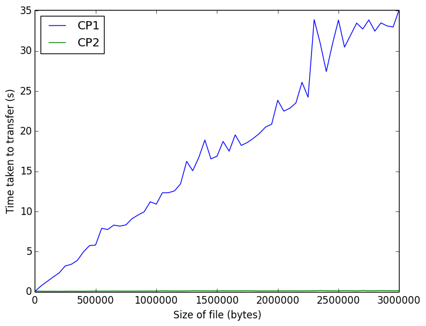

# Java Secure File Transfer 

### Instructions

Make sure you are inside */src* folder
```bash
# assuming you are in project root directory
cd src/
```

Spin up the server to wait for new client connection
```bash
# if you want to run cp1 server 
./cp1Server.sh

#if you want to run cp2 server 
./cp2Server.sh
```

Start client to send a file
```bash
# if you are using cp1 
./cp1Client.sh <path to file you want to upload>

# if you are using cp2
./cp2Client.sh <path to file you want to upload>
```

The uploaded file will be saved inside /src/upload folder

### File Structure

- _/src/assets/_: Our public/private keys and signed certificate
- _/src/common/_: Package containing all shared utility 
functions between cp1 and cp2
- _/src/cp1/_: Package containing server and client 
implementation for CP 1
- _/src/cp2/_: Package containing server and client 
implementation for CP 2
- _/src/cp*.sh_: Shell scripts used for starting servers 
and clients
- _/src/test.sh_: Shell script used for generating data for 
performance comparison graph
- _/src/draw.py_: Python script used for plotting graphs for 
performance comparison

### Specification of Protocols

#### Space Sequence Diagrams


### Performance Comparison

**Disclaimer**: All performance tests are done on a MacBook 
Pro 2015 with 2.7Ghz dual-core Intel i5 and 16GB Memory

#### Performance of CP1 



#### Performance of CP2


### Comparing Performances of CP1 vs CP2



### Team Members

- Vivek Kalyan (1001457)
- Nguyen The Hung (1001692)

### Acknowledgement

_SUTD 50.005 Computer System Engineering Instructors and TAs_ 

- Prof. David Yau
- Prof. Jit Bitwas
- Mujeeb Ahmed
- Eyasu Getahun Chekole
- Shuailong Liang